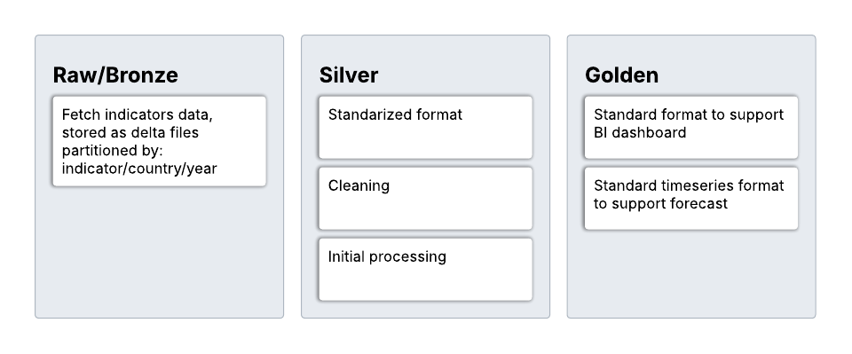

# Prosperity Lakehouse

Comparison tool to visualize the status of different indicators across the world

## Overview

## Indicators

### World Bank

#### Health

[% population with access to general health system](https://data360.worldbank.org/en/indicator/UHC_SCI)

#### Water Sanitation

[% porcentage of population with access to free water](https://data.worldbank.org/indicator/SH.H2O.SMDW.ZS?view=map&year=2024)

#### Education Access

[% population in working age with high education](https://data.worldbank.org/indicator/SL.TLF.ADVN.ZS?year=2023)

#### Poverty

[% population in poverty](https://data.worldbank.org/indicator/SI.POV.DDAY?end=2024&locations=1W&start=1981&view=map)

#### Employment

[% informal employment](https://data360.worldbank.org/en/indicator/WB_HCP_EMP_NIFL_A)

#### Conservation

[total hectares of environments protected](https://data360.worldbank.org/en/indicator/WB_CSC_ER_PTD_TOTL_ZS?recentYear=false&year=2024)

